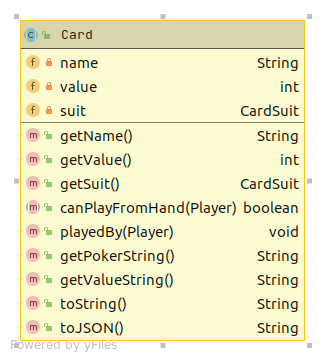
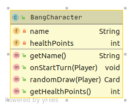
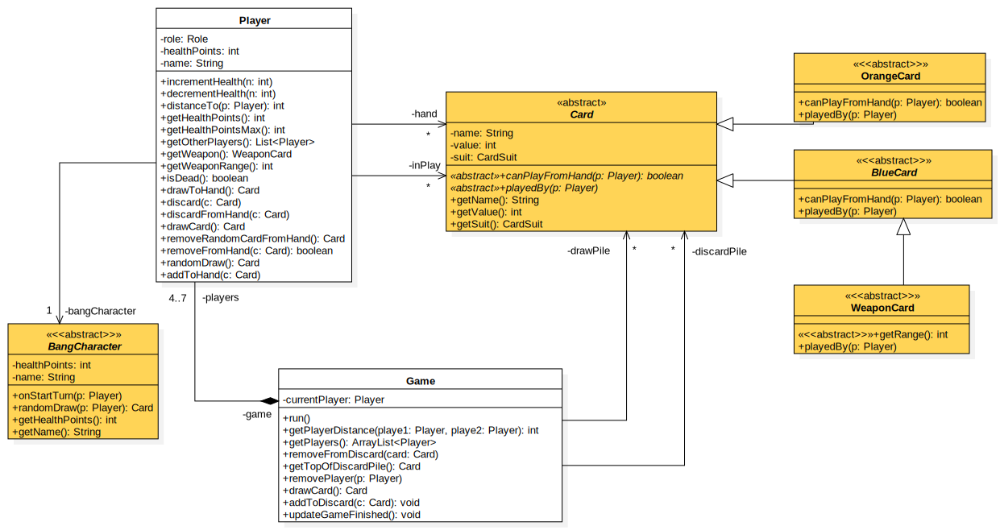

# 

# Bases de la programmation orientée objet

### IUT Montpellier-Sète – Département Informatique

* **Cours:** [M2103](http://cache.media.enseignementsup-recherche.gouv.fr/file/25/09/7/PPN_INFORMATIQUE_256097.pdf) - support [ici](https://github.com/IUTInfoMontp-M2103/Ressources)
* **Enseignants:** [Marin Bougeret](mailto:marin.bougeret@umontpellier.fr), [Romain Lebreton](mailto:romain.lebreton@umontpellier.fr), [Sophie Nabitz](mailto:sophie.nabitz@univ-avignon.fr), [Victor Poupet](mailto:victor.poupet@umontpellier.fr), [Petru Valicov](mailto:petru.valicov@umontpellier.fr)
* Le [forum Piazza](https://piazza.com/class/kjifrxy1n0i3xa) de ce cours pour poser vos questions
* [Email](mailto:petru.valicov@umontpellier.fr) pour une question d'ordre privée concernant le cours.

# Projet - _Bang !_

**Date de rendu : 9 mai 2021 à 23h00**  

Le lien pour le fork avec GitHub Classroom et les consignes du projet vous sont données dans le fichier [Consignes.md](Consignes.md).
_**Le non-respect de ces consignes impliquera des pénalités significatives sur la note du projet**_ 

## Présentation
Le but de ce projet est de produire une implémentation en _Java_ du jeu de cartes [_Bang!_](https://fr.wikipedia.org/wiki/Bang!_(jeu_de_cartes)).

_Bang!_ est un jeu de cartes inventé par Emiliano Sciarra pour 4 à 7 joueurs. C'est un jeu où les joueurs possèdent chacun un **rôle**, qui détermine leurs objectifs :
 * **Shérif** : doit éliminer le(s) renégat(s) et les hors-la-loi.
 * **Adjoints du shérif** : veillent à ce que le shérif survive. Il peut y avoir entre 0 et 2 adjoints.
 * **Hors-la-loi** :  doivent éliminer le shérif. Il peut y avoir entre 2 et 3 hors-la-loi.
 * **Renégat** : doit éliminer le shérif **en dernier** (les autres joueurs doivent être éliminés avant).
 
Le joueur ayant le rôle de shérif est révélé au début de la partie, tous les autres rôles sont gardés secrets.
 
En plus du rôle, chaque joueur a un **personnage** qui lui donne des pouvoirs supplémentaires. Ce personnage est connu de tous.

Par ailleurs, chaque joueur a un certain nombre de **cartes de jeu** dans sa main (cachées des autres joueurs). Ces cartes peuvent être utilisées au cours de la partie pour effectuer différentes actions ou renforcer le personnage.

Pour simplifier, dans la version qu'on vous propose de programmer ici, il n'y aura qu'un interface commune du jeu et par conséquent toutes les informations seront visibles. Cela permettra de debugguer plus facilement le programme.

Le fichier [règles de base](ressources/sujet/Bang-regles.pdf) contient les règles principales du jeu (une [version en anglais](ressources/sujet/bang-rules.pdf) est également disponible).

**Quelques conseils avant de poursuivre la lecture du sujet :**
* Si ce n'est toujours pas fait, écouter l'enregistrement de la présentation du sujet faite par Victor Poupet (sur Moodle, dans *Cours POO*).
* Lire les règles du jeu.
* Jouer à _Bang!_ avant de commencer à coder, pourrait vous être également utile ! Une version en ligne est disponible à l'adresse : https://bang.zanapher.fr/

**Remarque :** Il existe de nombreuses extensions pour _Bang!_ qui ajoutent des règles supplémentaires. Dans ce projet nous ne considérerons que le jeu de base avec quelques simplifications.

**Remarque :** Les classes, attributs et méthodes de ce projet seront en anglais afin de se rapprocher de la version internationale du jeu. En revanche, la documentation du code est en français. 

### Les cartes
Dans le jeu il y a deux types de cartes : bleues et oranges.
Il peut exister plusieurs copies de chaque carte, mais deux cartes ayant le même nom ont des caractéristiques identiques (on dira que deux cartes identiques sont de la même _famille_).
En tout il y a 22 cartes de jeu différentes (cf. pages 3-7 de la [liste complète de cartes du jeu](ressources/sujet/card-list.pdf)).

Par ailleurs, l'ensemble des cartes utilisées est déterminé en début de partie (80 normalement) et à tout moment de la partie chaque carte est  
* soit dans la _réserve_ (_drawPile_), commune à tous les joueurs et disponible à la pioche ;
* soit dans la pile de cartes _défaussées_ (_discardPile_) ;
* soit dans la main d'un joueur (_hand_) ;
* soit en jeu, posée devant le joueur (_inPlay_).

L'intégralité des classes de cartes se trouve dans le paquetage `fr.umontpellier.iut.bang.cards`.

#### La classe `Card` et ses sous-classes
Les cartes du jeu sont représentées par des objets de la classe `Card` :

**Important** : le code de la classe `Card` qui vous est donné, à priori ne devrait pas être modifié. Cependant, vous pouvez ajouter des nouvelles fonctions et attributs si vous le souhaitez.

Remarquez que chaque carte a une valeur (de 2 à l'As), ainsi qu'une couleur (Pique, Coeur, Carreau ou Trèfle). Ces attributs sont utilisés pendant la partie pour faire des tirages aléatoires (c'est l'action "dégainer" dans les [règles](ressources/sujet/Bang-regles.pdf)).
Dans le code la couleur est désignée par le type énuméré `CardSuit` et la valeur par un `int`.

#### Liste des cartes inventaire (bleues et oranges)
Les 22 types de cartes du jeu de base sont représentés par des classes correspondantes héritant de `Card`. Vous aurez à les implémenter. Pensez à consulter les [règles](ressources/sujet/Bang-regles.pdf) du jeu concernant les cartes bleues et oranges.

Afin de vous indiquer la logique d'implémentation des cartes, le code des cartes `GeneralStore` et `StageCoach` vous est intégralement donné. 

### Les personnages
Les personnages sont représentés par la classe `BangCharacter` et ses sous-classes. Le tout se trouve dans le paquetage `fr.umontpellier.iut.bang.characters`.

À part les deux getters, la classe `BangCharacter` contient deux fonctions spéciales. La méthode `onStartTurn(Player p)` est appelée par la classe `Player` au début du tour du joueur lorsque celui-ci doit piocher des cartes. L'implémentation de cette méthode correspond au comportement par défaut : piocher 2 cartes. Cependant, plusieurs personnages modifient cette règle et vous devrez donc la redéfinir dans les sous-classes correspondantes.

De manière similaire, la méthode `randomDraw(Player p)` est appelée lorsqu'un joueur doit "dégainer" c'est-à-dire retourner une carte pour un tirage aléatoire. Le comportement par défaut est de retourner la première carte de la pioche, mais certains personnages peuvent avoir des comportements différents.

Pensez à consulter les [règles](ressources/sujet/Bang-regles.pdf) de jeu concernant les personnages.

Afin de vous indiquer la logique d'implémentation des personnages, le code de `BlackJack` vous est intégralement donné. 

**Remarque** : la capacité spéciale du personnage _Sid Ketchum_ ne s'implémente pas correctement sans changer la structure globale du jeu et de ce fait, nous n'implémenterons pas ce personnage dans le projet.

### Les joueurs

Les joueurs de la partie sont identifiés par un nom (de type `String`). À tout moment de la partie, les cartes que possède un joueur peuvent être dans l'un des 2 emplacements suivants :

* sa _main_ (_hand_) ;
* _en jeu_ (_inPlay_).

#### La classe `Player`

Les joueurs participant à une partie de _Bang!_ sont représentés par des instances d'une classe `Player`. Le nom, les compteurs (points de vie), les différents emplacements de cartes du joueur ainsi que la partie dans laquelle il se trouve sont représentés par des attributs de cette classe.

#### Déroulement du tour

Quand c'est son tour le joueur doit exécuter les étapes suivantes dans l'ordre :

1. Résolution des effets préliminaires (prison ou dynamite)
1. Prendre deux cartes dans la pioche (cette étape peut éventuellement être modifiée par les capacités du personnage) 
1. Jouer des cartes de sa main (poser des cartes devant soi ou exécuter des cartes oranges). À ce moment, le joueur peut jouer autant de cartes qu'il le souhaite.
1. Défausser les cartes en trop, car le joueur ne peut pas garder plus de cartes en main qu'il n'a de points de vie.

### La partie

Une partie de _Bang!_ est représentée par une instance de la classe `Game`. Cette classe gère la liste des joueurs et l'ensemble des cartes communes. Elle contrôle également le déroulement de la partie : mise en place, alternance des tours des joueurs et fin de partie lorsque les conditions de fin sont remplies.

Pour démarrer une partie, il faut spécifier le nombre de joueurs qui y participent ainsi que la liste des cartes à utiliser comme pile de réserve. Le code du constructeur de la classe `Game` vous est entièrement fourni (normalement vous n'avez pas à le modifier).

Voici les conditions de victoire et de fin de partie :
* le shérif et ses adjoints (`DEPUTY`) gagnent si le shérif est vivant alors que tous les hors-la-loi et le renégat (`RENEGADE`) sont morts ;
* le renégat (`RENEGADE`) gagne s'il réussit à tuer le shérif en dernier (tous les autres joueurs étant déjà morts) ;
* les hors-la-loi (`OUTLAW`) gagnent dans tous les autres cas :
  * si le shérif est mort et un des hors-la-loi est encore en vie ;
  * si le shérif est mort et il reste deux autres joueurs vivant dans la partie.

Le diagramme de classes **simplifié** ci-dessous illustre une vue d'ensemble de l'application. Ce diagramme ne contient que les classes principales avec les attributs, méthodes et relations essentiels. Certaines méthodes vous sont données et les autres vous aurez à les écrire. Comme indiqué précédemment, vous pouvez ajouter d'autres classes, méthodes et attributs si cela vous semble nécessaire.

Les détails liés à l'interface utilisateur et à l'affichage (voir section ci-dessous) ne sont pas présentés dans le diagramme de classe ci-dessus car vous n'aurez pas à les programmer (au passage, cela ne représente pas la couche metier de l'application).

### Interface utilisateur

L'interface utilisateur que vous aurez à gérer sera entièrement en ligne de commandes. Les informations du jeu seront affichées à l'écran en utilisant la sortie standard et les choix des joueurs se feront par lecture sur l'entrée standard (clavier). Une fois la partie lancée, toutes les interactions avec l'utilisateur se feront donc dans le terminal. Dans une partie à plusieurs joueurs, un même processus demande successivement aux joueurs de jouer leur tour dans le même terminal.

 **Important** : le code gérant l'ensemble d'affichages utilisateur dans le terminal vous est fourni. Si vous êtes amenés à faire des modifications, pour notamment afficher des informations supplémentaires, vous utiliserez les méthodes d'affichage fournie et veillerez à ce que cela n'affecte pas le fonctionnement général de ces fonctions.

#### Interface graphique (web)
 Pour rendre l'expérience ludique, et pour que votre jeu rassemble à un _vrai_ jeu, une interface graphique vous est également fournie. Cette interface interprète la saisie console et affiche le jeu de manière plus proche d'un utilisateur non-informaticien dans un navigateur. Vous n'aurez pas à la modifier (ni à adapter votre code), cette partie étant complètement indépendante de votre projet.
 
 **Important** : Des méthodes spéciales `String toJSON()` et `void prompt()` ont été ajoutées aux classes `Card`, `Game` et `Player`. Elles sont nécessaires pour l'IHM. **Vous ne devriez pas les modifier !**
 
 **Important** : L'interface graphique est compatible sur Linux et MacOS. Sur les autres systèmes d'exploitation, le comportement de l'IHM ne sera pas garanti. 

### Rendu attendu

L'intégralité du code source du projet doit résider dans le dépôt GitHub associé à votre équipe de projet. Vous devez compléter les classes Java qui vous sont données et ajouter des nouvelles classes si nécessaire.

Toutes les méthodes qui lèvent une exception avec l'instruction `throw new RuntimeException("Méthode non implémentée !")` doivent être complétées selon les spécifications (en respectant leurs signatures). Vous êtes encouragés à ajouter des attributs et méthodes aux classes, lorsque cela vous semble nécessaire. La modification du corps des méthodes qui vous sont fournies est possible à condition de ne pas modifier le fonctionnement général de ces fonctions (décrit dans la spécification des méthodes).

**Rappel : pas de modification des signatures des méthodes/attributs qui vous sont fournis.**

L'exécution de la méthode `main(String args[])` de la classe `AppBang` (à la racine du projet) doit démarrer une partie avec un nombre de cartes inventaire correspondant au nombre de vies attribuées au joueur.
Cette fonction servira simplement à exécuter manuellement une partie et à faire des petites simulations.

#### Évaluation

L'évaluation du projet se fera à l'aide de **tests unitaires** automatisés. L'ensemble des cartes et de personnages, ainsi que la classe `Game`et `Player` seront évaluées de cette manière. Les tests sont faits indépendamment du choix de cartes pour la partie exécutée par la méthode `main(String args[])`.

Un premier jeu de tests vous est fourni (comme d'habitude dans le répertoire `src/test/java`) pour que vous puissiez vérifier le bon fonctionnement des fonctionnalités de base. Puis nous utiliserons un second jeu de tests (secret) pour l'évaluation finale.

Il est donc attendu que les projets rendus passent le premier jeu de tests sans erreurs (afin d'avoir une moyenne de 8/20). Naturellement, vous devez également vérifier par vous-mêmes (en écrivant d'autres tests unitaires) que le projet se comporte correctement dans les différents cas particuliers qui peuvent se produire et qui ne sont pas nécessairement couverts par les tests qui vous ont été fournis.

**Remarque importante** : puisque l'évaluation des rendus se fait par des tests automatisés, **les projets qui ne compilent pas seront automatiquement rejetés** et la note sera 0.
